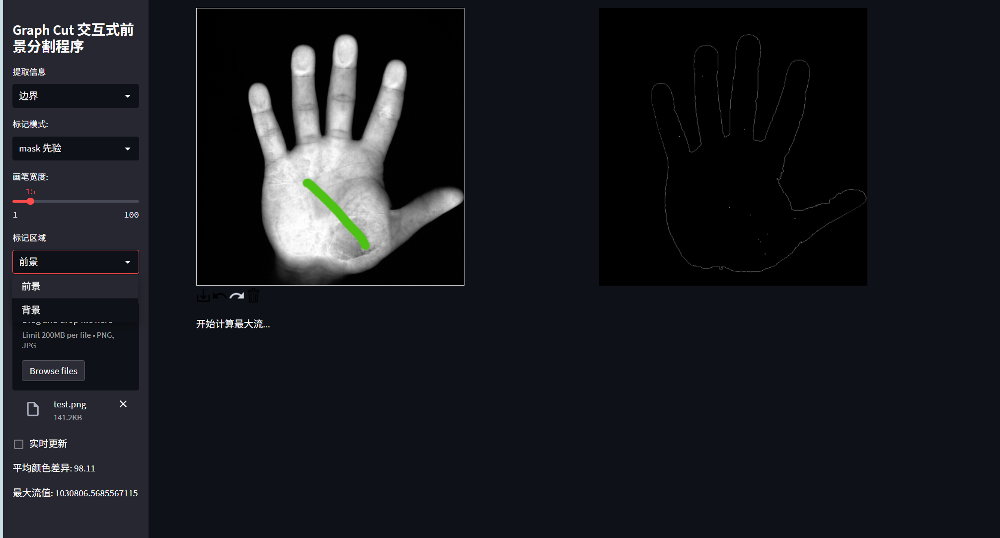
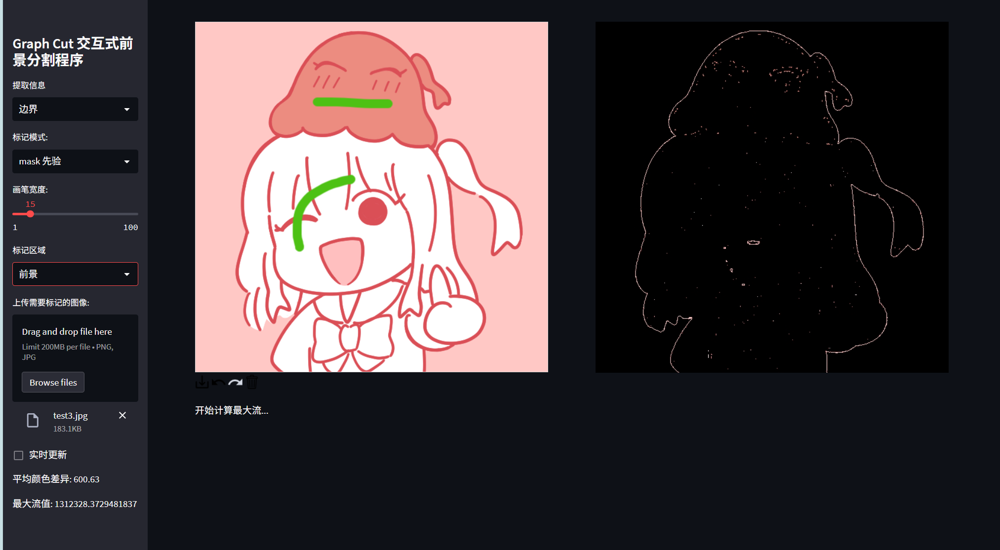
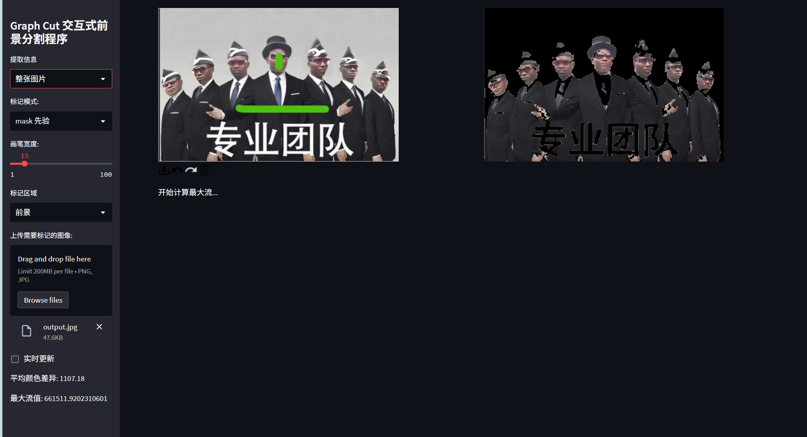

# 实验报告

### 实现思想

图像分割任务实际上和最小割目标相似，图片分割任务需要将图片分为前景和后景，我们希望前景和后景的差异尽可能大，而最小割则是两个割的割边容量尽可能小

因此我们可以把图片建立为一个图，像素点与周围四个方向的像素点联通，然后目标是建模边的值，使得相同分类的像素点间值尽可能大，而不相同分类点间的值尽可能小（则最小割倾向于将他们的边割开）；还需要注意的一点是，这是一个无向图，因此建立边的时候需要建立两条边；最小割需要一个起点和终点，起点和终点与所有点相连。

下面是建立边值，分为起终点与所有点连接的边t-link，以及像素点之间的边n-link；

对于t-link，我们令起点为背景，终点为前景，那么对于起点来说，他和可能为背景像素点的边值应当尽可能的大，我们的希望是分类$\prod_{i=1} P(\hat{label}|I_P)$(其中$I_p$为像素点，label为预估的分类)越大，而对他们取ln则变为累加了，着与割边和最小的目标相同，因此我们给背景与像素点边的值建模：

$$
cost(background,I_p)=
\begin{cases}
0, & I_p被用户标注为前景 \\
1+\max{\sum_{q,q\in E(p)} B(p,q)},   & I_p被用户标注为背景\\
-ln(P(I_P|front)),    &其他\\
\end{cases}
$$

这里front的概率指的是用户标注的直方图所得到的信息，而且为什么是front？因为我们希望越可能是背景点的cost应当越大；中间那个值是因为我们希望他尽量大，而且不被像素点间的边值所干扰

那么前景点相似，需要注意方向

$$
cost(I_p,foreground)=
\begin{cases}
0, & I_p被用户标注为背景 \\
1+\max{\sum_{q,q\in E(p)} B(p,q)},   & I_p被用户标注为前景\\
-ln(P(I_P|back)),    &其他\\
\end{cases}
$$

对于n-link

我们建模为$cost(p,q)=exp(-\beta {\left| I_p-I_q \right|}^2)$，其中$\beta=\frac{1}{E({\left| I_p-I_q \right|}^2)}$

这个$\beta$的值非常重要，如果调整不正确的会导致差异均衡不正确而分割失败

好了建模完了，我们需要用dicnic算法来算最大流，一开始用的FF算法，但是会因为栈深度过高而程序退出，因此需要用bfs进行分层和忽略流量等于0的边，然后再每次走最长增广链（即只能走下一层的顶点，不能同层或者超层），最后直到没有增广链时候算法结束

### 实验代码

###### 建模

建立n-link

```python
for t in range(2):
    ni = i + dy[t]
    nj = j + dx[t]
    if 0 <= ni < height and 0 <= nj < width:
        neighbor_id = ni * width + nj
        diff = np.sum((img_array[i, j] - img_array[ni, nj]) ** 2)
        weight = np.exp(-beta * diff)
        # graph[pixel_id].append((neighbor_id, weight))
        max_flow_solver.add_edge(pixel_id, neighbor_id, weight, weight)
for t in range(4):
    ni = i + dy[t]
    nj = j + dx[t]
    if 0 <= ni < height and 0 <= nj < width:
        neighbor_id = ni * width + nj
        diff = np.sum((img_array[i, j] - img_array[ni, nj]) ** 2)
        weight = np.exp(-beta * diff)
        K_sum += weight
K = max(K, K_sum)
```

建立t-link

```python
if background_mask[i, j] == 255:
    max_flow_solver.add_edge(background_id, pixel_id, K, 0)
    max_flow_solver.add_edge(pixel_id, foreground_id, 0, 0)
elif foreground_mask[i, j] == 255:
    max_flow_solver.add_edge(pixel_id,foreground_id, K, 0)
    max_flow_solver.add_edge(background_id, pixel_id, 0, 0)
else:
    max_flow_solver.add_edge(background_id, pixel_id, data_cost_foreground, 0)
    max_flow_solver.add_edge(pixel_id, foreground_id, data_cost_background, 0)
```

###### 建边

最大流使用cpp写的

需要存储反向边的位置，用于快速定位反向边

```cpp
graph[from].push_back({to, to_idx, cap});
graph[to].push_back({from, from_idx, revcap});
```

bfs分层

dfs搜索增广链，边搜索边记录最小值

```cpp
if (level[v] + 1 == level[e.to] && e.cap > 1e-9) {
    double d = dfs(e.to, t, std::min(f, e.cap));
    if (d > 1e-9) {
        e.cap -= d;
        graph[e.to][e.rev].cap += d;
        return d;
    }
}
```

获取割点集，即从起点出发残量网络能到达的点和不能到达的点

获取边界，s点集中存在不可到达点的边，那么他就是割点，他的边是割边

```cpp
while (!q.empty()) {
    int v = q.front();
    q.pop();
    for (auto& e : graph[v]) {
        if (!visited[e.to] && e.cap > 1e-9) {
            visited[e.to] = true;
            q.push(e.to);
        }
        if (!visited[e.to] && e.cap<=1e-9 && e.to!=s && e.to!=s+1) {
            bound[v] = true;//记录割点
        }
    }
}
```

### 实验结果

有些图片比较大可以通过 `down.py`进行降采样

可以选择提取边界还是整张图片，绿笔标注前景，红笔标注背景





提取整张图片



### 参考资料

Interactive graph cuts for optimal boundary & region segmentation of objects in N-D images

[(99+ 封私信 / 81 条消息) 基于 Graph Cut 的可交互式图像分割——原理与代码实现 - 知乎](https://zhuanlan.zhihu.com/p/671470269)
